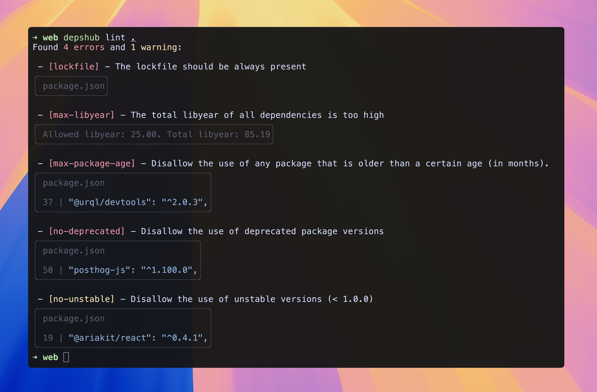

> [!important]
> This package is still under active development. Read [Contributions](https://docs.depshub.com/misc/contributions/index.html) on how to improve it.

# DepsHub

![dependencies](https://img.shields.io/github/actions/workflow/status/depshubhq/depshub/depshub.yml?branch=main&label=DepsHub&fedcba&logo=data:image/svg%2bxml;base64,PHN2ZyB3aWR0aD0iNzAiIGhlaWdodD0iNzgiIHZpZXdCb3g9IjAgMCA3MCA3OCIgZmlsbD0ibm9uZSIgeG1sbnM9Imh0dHA6Ly93d3cudzMub3JnLzIwMDAvc3ZnIj4KPHBhdGggZD0iTTMuOTAwMSA0NS42ODk5QzQuMDMyNDUgNDUuNzk1MSA0LjE2ODQ0IDQ1Ljg5ODYgNC4zMDgwOCA0Ni4wMDA2TDI1LjMwNzcgNjEuMzMwOEMzMC42NjA2IDY1LjIzODQgMzkuMzM5MiA2NS4yMzg0IDQ0LjY5MiA2MS4zMzA4TDY1LjY5MTcgNDYuMDAwNkM2NS44MzEzIDQ1Ljg5ODYgNjUuOTY3MyA0NS43OTUgNjYuMDk5NyA0NS42ODk5QzcxLjA0MDkgNDkuNjE1OCA3MC45MDQ5IDU1LjcyNDQgNjUuNjkxNyA1OS41MzAxTDQ0LjY5MjEgNzQuODYwM0MzOS4zMzkyIDc4Ljc2OCAzMC42NjA2IDc4Ljc2OCAyNS4zMDc4IDc0Ljg2MDNMNC4zMDgxMSA1OS41MzAxQy0wLjkwNTA2MyA1NS43MjQ0IC0xLjA0MTA3IDQ5LjYxNTggMy45MDAxIDQ1LjY4OTlaIiBmaWxsPSJ3aGl0ZSIvPgo8cGF0aCBkPSJNNC4zMDgwOCAzMi43NjU0Qy0xLjA0NDc1IDI4Ljg1NzcgLTEuMDQ0NzUgMjIuNTIyMSA0LjMwODA4IDE4LjYxNDVMMjUuMzA3NyAzLjI4NDI3QzMwLjY2MDYgLTAuNjIzNDAzIDM5LjMzOTIgLTAuNjIzNDAzIDQ0LjY5MiAzLjI4NDI3TDY1LjY5MTcgMTguNjE0NUM3MS4wNDQ1IDIyLjUyMjEgNzEuMDQ0NSAyOC44NTc3IDY1LjY5MTcgMzIuNzY1NEw0NC42OTIgNDguMDk1NkMzOS4zMzkyIDUyLjAwMzMgMzAuNjYwNiA1Mi4wMDMzIDI1LjMwNzcgNDguMDk1Nkw0LjMwODA4IDMyLjc2NTRaIiBmaWxsPSJ3aGl0ZSIvPgo8L3N2Zz4K)

> - How do we keep everything up to date while spending the least time possible?
> - Do we still use this library?
> - When should we update?
> - Do we have any security issues in our dependencies?
> - How to stop the updates noise?

**DepsHub** is a dependency management toolkit that lints, scans for problems, and updates your dependencies.

Focused on the developer experience and minimizing the noise.

[Documentation](https://docs.depshub.com) | [Installation](https://docs.depshub.com/installation/index.html) | [About](https://docs.depshub.com/why/index.html)

✨ Keep your dependencies tidy.

