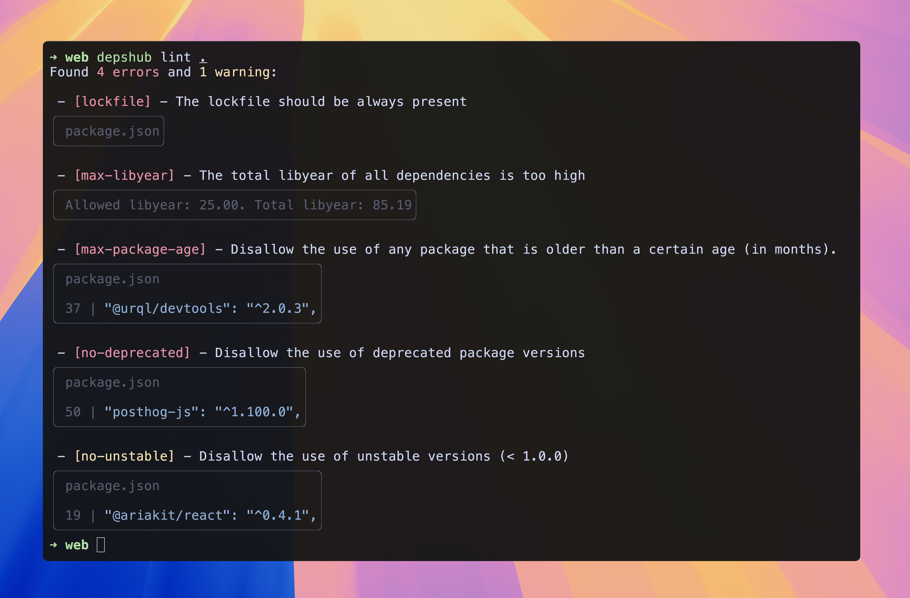

**DepsHub** is a single-binary open source dependency management tool that helps to keep your dependencies tidy.

It scans all the dependencies in your project, finds inconsistent versions, unused dependencies, unmaintained packages, security vulnerabilities, etc., and helps you fix and prevent them.

It's designed to be used both locally and in CI/CD pipelines, supporting [multiple](/misc/supported) languages and package managers.

The source code is available on [GitHub](https://github.com/depshubhq/depshub).

## Features

- **Advanced linting rules** - checks for 20+ common [issues](/reference/rules) in your dependencies.
- **Comprehensive data sourcing** - package registries data, licenses information, security vulnerabilities and more.
- **Interactive** - update your dependencies with a single command.
- **Configurable** - customize the default behavior with a [configuration](/reference/configuration-file) file.
- **Extensible** - create [custom](/guides/custom) rules to enforce your own policies.
- **CI/CD ready** - integrates with your [CI/CD](/guides/integrations) pipelines.

